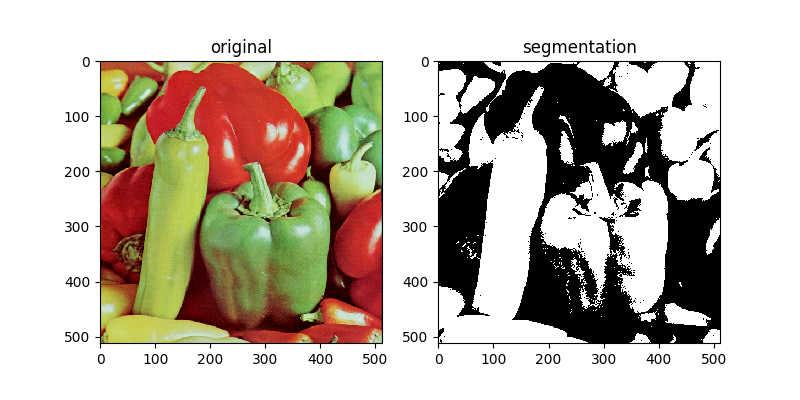
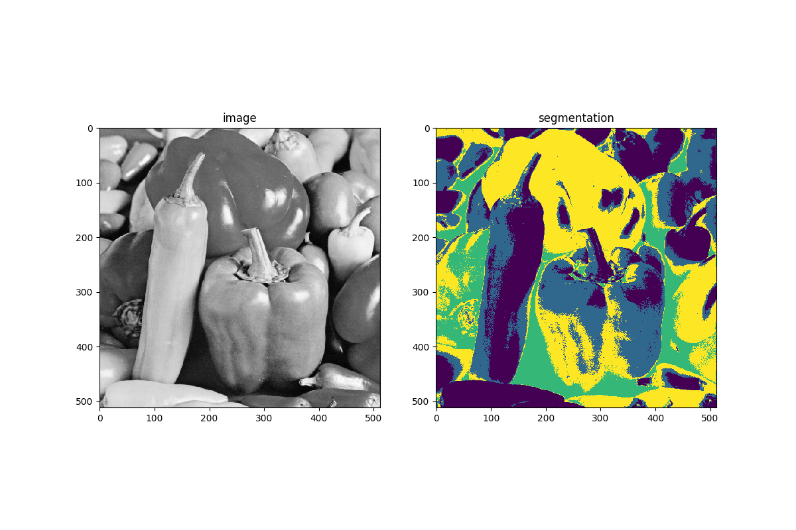

# Different implementation of FCM

[](https://travis-ci.org/joemccann/dillinger)

This code uses two various fuzzy c-means algorithms.

  - Classical FCM
  - Enhanced FCM 


### Run as defalut options

    Algorithm: FCM or EnFCM
    Number of bits of input images: 8
    Number of clusters: 4
    Fuzziness degree: 2
    Max number of iterations: 100
    Threshold to check convergence 'Epsilon': 0.05 
    Plotting results

```sh
python3 EnFCM.py  OR python3 FCM.py
```
- If you want to change the image you can edit one line of code in each document. 


### Results

| Algorithm | Output |
| ------ | ------ |
| FCM | |
| Enhanced FCM |   |

### References
- [1] [EnFCM](resources/FCM_UsingHistogram.pdf)
- [2] [FCM](resources/Robust_FCM_Model.pdf)
- Both papers were used to understand FCM & EnFCM. 
